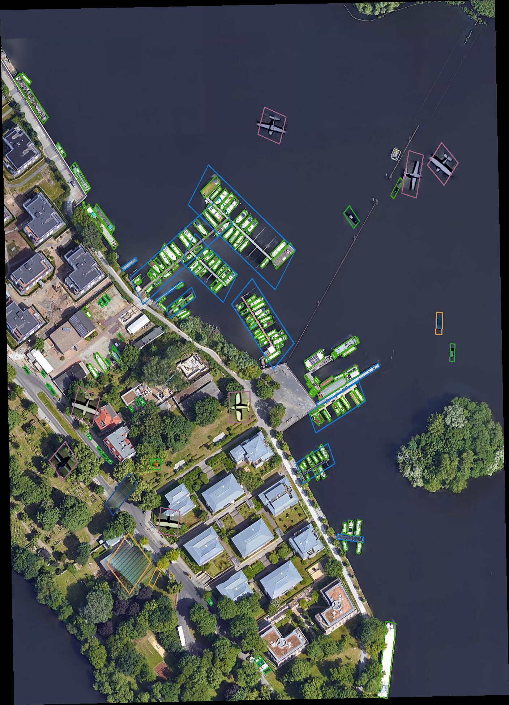

# Copy-paste-Augmentation_rotate
实现了基于YOLOv5旋转标签格式的Copy-paste小目标数据增强，数据集为DOTA。
本项目是在[SmallObjectAugmentation-master](https://github.com/kangpeilun/SmallObjectAugmentation-master/tree/main/SmallObjectAugmentation-master)
的基础上得到的。
修改如下：  
1. 适配旋转标签 (classID, x, y, long, short, angle)
2. 根据旋转标签，仅裁剪目标本身矩形区域，不包含多余的背景
3. 对增强目标加入随机旋转角度
4. 不限制增强目标类别

## 函数方法说明：
* `crop_img.py` 使用YOLOv5标准格式，裁剪图片中的小目标。
* `crop_rotated.py`  使用YOLOv5旋转标签格式，裁剪图片中的小目标。
* `copy_paste.py` 使用裁剪的小目标图片和旋转标签，执行copy_paste数据增强

## 使用方法：
`1. 下载图像并转换标签 `
* Demo图片和标签存放在`./data`下，可以测试使用。
* [完整DOTA数据集下载地址](https://captain-whu.github.io/DOAI2019/dataset.html)
* DOTA数据集标签转换方法请参考 [hukaixuan19970627/DOTA_devkit_YOLO](https://github.com/hukaixuan19970627/DOTA_devkit_YOLO).
* 转换后的标签格式为：（其中angle∈[0, 180)）
```
  classID    x_center   y_center   longside   shortside    angle    
```

`2. 裁剪小目标`
* 修改`crop_rotated.py`中的`data_root`和`txt_save`为你的图片和标签路径（
  默认图片路径`./data/images` 标签路径`./data/yolo_labels_rotated` ） 
* 运行`crop_rotated.py`
* 裁剪后的图像保存在`./data/crops`，筛选裁剪后的小目标，`small.txt`保存裁剪图像的目录和类别，不需要手动更新，在图像增强之前会自动扫描目录。


`3. 图像增强` 
* 修改待增强的图片路径`imgDir`和标签路径`labelDir`
* 运行`copy_paste.py`
* 增强图像保存在`./output/images`，标签保存在`./output/labels`
* 效果如下图：



## 参考
感谢以下的项目
* [SmallObjectAugmentation-master](https://github.com/kangpeilun/SmallObjectAugmentation-master/tree/main/SmallObjectAugmentation-master)
* [ultralytics/yolov5](https://github.com/ultralytics/yolov5).
* [DOTA_devkit_YOLO](https://github.com/hukaixuan19970627/DOTA_devkit_YOLO).
